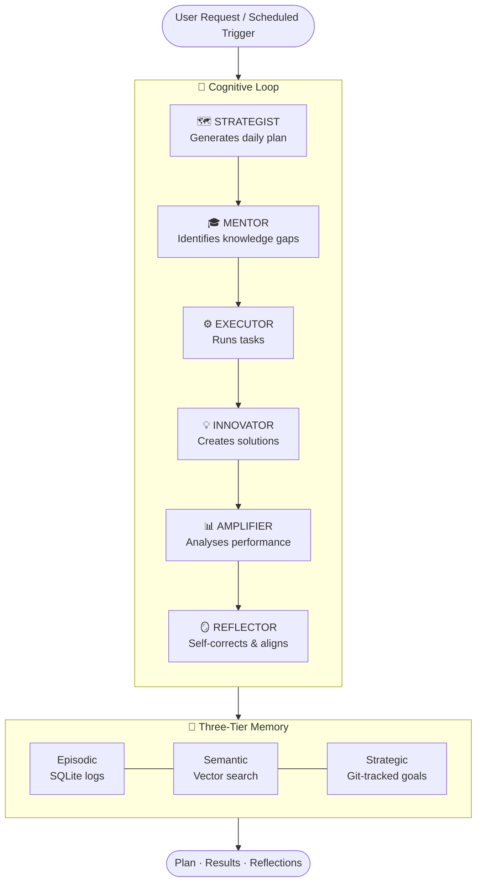

# JARVIS — AI Cognitive Assistant

[](https://github.com/lamiaakter14/jarvis/actions/workflows/ci.yml)
[](https://www.python.org/downloads/)
[](https://www.typescriptlang.org/)
[](LICENSE)

---

## What is JARVIS?

JARVIS is an **enterprise-grade AI cognitive assistant** built on a multi-agent architecture. It is not a single model wrapper. It is an orchestrated system of six purpose-built agents that collaborate through a shared **cognitive loop** to help you plan, execute, innovate, and self-correct — across every session.

Built on Clean Architecture: the domain logic is completely independent of AI provider, database, or interface. Swap the LLM, change the database, add a new interface — none of it touches your business rules.

---

## The Cognitive Loop

Every JARVIS session runs one complete cognitive loop — six agents activated in sequence, sharing context through a three-tier memory system.



Each cycle produces a coherent output: a prioritised plan, executed tasks, identified gaps, generated innovations, performance insights, and a self-correction pass.

---

## Six Specialized Agents

| Agent | Role |
|-------|------|
| 🗺️ **STRATEGIST** | Prioritises tasks and builds a time-blocked daily plan using ROI and cognitive load heuristics |
| 🎓 **MENTOR** | Surfaces knowledge gaps from completed and failed tasks; attaches learning recommendations |
| ⚙️ **EXECUTOR** | Drives task execution, updates status, and logs outcomes to episodic memory |
| 💡 **INNOVATOR** | Generates creative solutions for identified gaps, scores them by feasibility and ROI |
| 📊 **AMPLIFIER** | Computes agent and system KPIs; feeds the analytics dashboard |
| 🪞 **REFLECTOR** | Detects drift from long-term goals and produces three concrete correction actions per cycle |

Each agent has a single, well-defined cognitive role. They share context through memory — not direct coupling.

---

## Why JARVIS is Different

**Most AI assistants are reactive.** They respond to a prompt, then forget everything.

JARVIS is **proactive and continuous**:

| Capability | Typical AI Tool | JARVIS |
|-----------|----------------|--------|
| Memory across sessions | ❌ | ✅ Three-tier (episodic, semantic, strategic) |
| Self-correction | ❌ | ✅ REFLECTOR closes the alignment loop every cycle |
| Multi-agent coordination | ❌ | ✅ Six agents with priority-based task queuing |
| Architecture independence | ❌ | ✅ Domain layer has zero external dependencies |
| Observable execution | ❌ | ✅ Structured logs, tracing, live dashboard |
| Extensible by design | ❌ | ✅ Swap LLM, DB, or add agents without touching business logic |

---

## Quick Start

```bash
git clone https://github.com/lamiaakter14/jarvis.git
cd jarvis
cp .env.example .env          # add your OPENAI_API_KEY
docker-compose up -d postgres redis
make install && make api       # API on :8000
make web                       # Dashboard on :3000
```

- **API docs**: http://localhost:8000/docs
- **Dashboard**: http://localhost:3000
- **Run cognitive loop**: `POST /api/cognitive-loop`

---

## Documentation

| Document | Audience |
|----------|---------|
| [System Intelligence](docs/SYSTEM_INTELLIGENCE.md) | Full technical report — architecture, agents, memory, security, extension points |
| [Quick Start](docs/QUICK_START.md) | Get running in minutes |
| [API Documentation](docs/API_DOCUMENTATION.md) | Complete endpoint reference |
| [Deployment Guide](docs/DEPLOYMENT_GUIDE.md) | Docker, Kubernetes, production setup |
| [Usage Guide](docs/USAGE_GUIDE.md) | Features and workflows |
| [Contributing](CONTRIBUTING.md) | How to contribute |

---

## 🤝 Contributing

1. Fork the repository
2. Create a feature branch
3. Run tests: `make test`
4. Submit a pull request

See [CONTRIBUTING.md](CONTRIBUTING.md) for full guidelines.

## 📄 License

MIT — see [LICENSE](LICENSE).

---

**Built with ❤️ using Clean Architecture, FastAPI, React, and OpenAI GPT-4**
